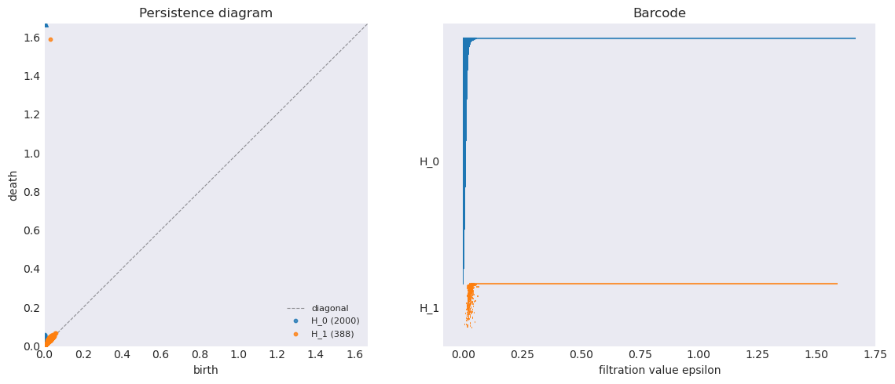
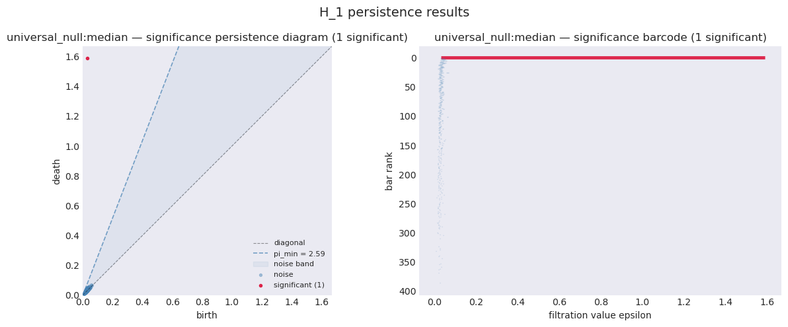

# TDA-PHANTOM
Topological data analysis -
Persistent Homology Analysis via Null Testing On Manifolds (TDA-PHANTOM)
is a tool for statistically analysing significance of persistence diagrams and barcodes.

This project implements hypothesis tests from:

- *Confidence Sets for Persistence Diagrams*
  Fasy et al. (2014)
  DOI: https://doi.org/10.1214/14-AOS1252

- *A Universal Null-Distribution for Topological Data Analysis*
  Bobrowski and Skraba (2023)
  DOI: https://doi.org/10.1038/s41598-023-37842-2


## Installation

Via [PyPI](https://pypi.org/project/tdaphantom/):

```bash
pip install tdaphantom
```
Or you can clone this repository and install it manually:

```bash
python setup.py install
```

## Overview

This tool can build a Vietoris-Rips complex from either a point cloud or distance matrix.

It can then be used to visualise the persistence diagram for that complex, and run various hypothesis tests for it.

The results of these hypothesis tests can be analysed via a return results array, or visualised in a signifiance persistence diagram.

## Example Usage

### Generate data

```python
def _make_circle(n=2000, noise=0.03, seed=1):
    rng   = np.random.default_rng(seed)
    theta = rng.uniform(0, 2 * np.pi, n)
    pts   = np.stack([np.cos(theta), np.sin(theta)], axis=1)
    return pts + rng.normal(0, noise, pts.shape)

pc_circle = _make_circle()
```

### Init Phantom class

```python
phantom_circle = Phantom(pc_circle)
```
### Calculate persistence diagram
Here we go up to homological dimension 1

```python
phantom_circle.calculate_dgms_from_point_cloud_ripser(k=1)
```


### Display persistence diagram

```python
phantom_circle.display_dgms()
```



### Run hypothesis test
```python
alpha      = 0.01
correction = None
methods    = ["universal_null"]

phantom_circle.hypothesis_test(alpha, correction_method=correction, methods=methods, k=1)
```

### Display signifiance persistence diagram

```python
phantom_circle.display_results()
```



## Basic useage


## Avaliable methods

## Universal null median
### Useage
### Theory

## Universal null mean
### Useage
### Theory

## Bottleneck subsampling
### Useage
### Theory

## TODO

* Add bottleneck shells
* Add bottleneck density
* Add bottleneck concentration
* Add more integeration tests
* Add more unit tests
